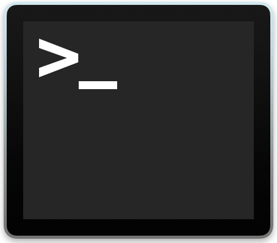

### Hi, I'm Jonas 👋

I'm a software developer/programmer/coder/engineer (whatever is the definition these days) working from Portugal.

Having suffered through my share of Friday deployments, coding in production, and manual testing, I have become obsessed with automating things, so I can sleep well at night.

-  Long time Windows user, slowly turning over to the lure of the dark terminal 
-  currently working on building a backend security system for [Volkswagen Digital Solutions](https://www.vwds.pt/)
-  currently focusing on getting my AWS SysOps exam done right.

Some Gists that I'm proud of:
- [save](https://gist.github.com/jonasmcferreira/cd9de6504c1f55dd8829dc7e7d6d1269) - git save command
- [bumpit](https://gist.github.com/jonasmcferreira/6171bb0478096373ce17501dd6097452) - Semantic version bumper
- [stopwatch](https://gist.github.com/jonasmcferreira/0e3a53a028d1c44cd2ade4b337ae6807) - a command line stopwatch

Tools:
- [sqs2sqs](https://github.com/jonasmcferreira/sqs-2-sqs) a tool to move messages from one SQS queue to another

Certs:

### **Mandatory Tech Logo board:**

### **Tools:**

